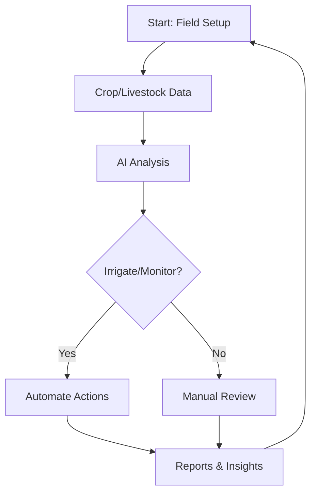

## Modular Design Overview

Applicious offers a flexible, modular platform tailored for modern agriculture. You can select and combine modules to match your operation, whether broadacre farming, horticulture, or mixed enterprises. Key areas include crop lifecycle tracking, livestock monitoring, financial management, property mapping, and community coordination.

Each module integrates seamlessly, powered by AI for insights like crop diagnostics and voice-to-task conversion. Start with core tools and scale as needed.

<Callout kind="info">
  Enable modules via your dashboard at `https://dashboard.applicious.com/settings/modules`. Contact support for custom integrations.
</Callout>

## Core Feature Modules

Discover the essential modules through these feature cards.

<Columns cols={3}>
  <Card title="Crop Lifecycle & Irrigation" icon="sprout" href="/docs/crop-management">
    Track planting, growth, and harvest stages with automated irrigation schedules based on soil moisture data.
  </Card>
  <Card title="Livestock Health & GPS" icon="activity" href="/docs/livestock">
    Monitor animal health, locations, and movements using GPS collars and AI alerts for anomalies.
  </Card>
  <Card title="Financial Expense Analysis" icon="trending-up" href="/docs/finance">
    Scan receipts, categorize expenses, and generate reports for budgeting and compliance.
  </Card>
  <Card title="Property GIS & Soil Analytics" icon="map" href="/docs/property">
    Map fields with GIS tools and analyze soil health via integrated sensor data.
  </Card>
  <Card title="Community Coordination" icon="users" href="/docs/community">
    Coordinate programs, specialist visits, and beneficiary groups with GPS-verified reporting.
  </Card>
</Columns>

## Implementing Key Workflows

Follow these steps to set up crop lifecycle tracking, a foundational feature.

<Steps>
  <Step title="Connect Sensors" icon="link">
    Integrate IoT sensors for soil moisture and weather data.

````bash
npm install @applicious/sdk
````

    Initialize the SDK:

````javascript
import { AppliciousSDK } from '@applicious/sdk';

const sdk = new AppliciousSDK({ apiKey: 'YOUR_API_KEY' });
await sdk.sensors.connect('field-123');
````
  </Step>
  <Step title="Define Lifecycle Stages" icon="calendar">
    Configure stages like planting, vegetative, and harvest.

    Use the API to set irrigation rules:

````javascript
await sdk.crop.createStage({
  fieldId: 'field-123',
  stage: 'vegetative',
  irrigation: { threshold: 30, duration: '2h' }
});
````
  </Step>
  <Step title="Monitor & Automate" icon="zap">
    Enable AI-driven alerts and auto-irrigation.

    Query status:

````javascript
const status = await sdk.crop.getLifecycle('field-123');
console.log(status); // { stage: 'vegetative', moisture: 45 }
````
  </Step>
</Steps>

## Module Comparisons

Compare modules across key capabilities using these tabs.

<Tabs>
  <Tab title="Crop vs Livestock" icon="sprout">
    | Feature | Crop Module | Livestock Module |
    |---------|-------------|------------------|
    | Tracking | Lifecycle stages | GPS positions |
    | Alerts | Irrigation needs | Health anomalies |
    | Integration | Sensors, weather | Collars, vets |
    | Reporting | Yield forecasts | Movement logs |
  </Tab>
  <Tab title="Finance vs Property" icon="dollar-sign">
    | Feature | Finance Module | Property Module |
    |---------|----------------|-----------------|
    | Data Input | Receipt scanning | GIS mapping |
    | Analysis | Expense trends | Soil sampling |
    | Outputs | Budget reports | Boundary analytics |
    | Compliance | Tax-ready exports | Zoning checks |
  </Tab>
</Tabs>

## Advanced Integrations

<Expandable title="API Integration Example" default-open="false">

For custom workflows, use the Applicious API.

<CodeGroup tabs="JavaScript,Python">
````javascript
// Fetch crop data
const response = await fetch('https://api.example.com/v1/crops/field-123', {
  headers: { Authorization: `Bearer ${YOUR_TOKEN}` }
});
const data = await response.json();
````
````python
import requests

response = requests.get(
    'https://api.example.com/v1/crops/field-123',
    headers={'Authorization': f'Bearer {YOUR_TOKEN}'}
)
data = response.json()
````
</CodeGroup>

</Expandable>

## Feature Workflow Diagram



<Callout kind="tip">
  Customize modules in your `https://dashboard.applicious.com` account. Explore [Quickstart](/quickstart) for initial setup.
</Callout>